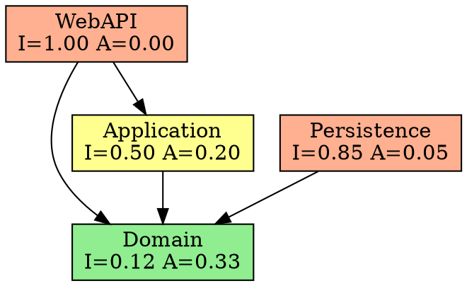

# Visualization Patterns for Dependency Analysis

This reference provides text-based formats for visualizing dependency structures,
reading dependency direction, detecting hidden coupling, and understanding
before/after refactoring outcomes.

## Text-Based Dependency Graph Format

Use directed arrows to show dependency direction. The arrow points FROM the
depender TO the dependee (the module being depended upon).

### Flat List Format

Best for small projects (fewer than 10 modules, fewer than 20 edges):

```
WebAPI        --> Domain
WebAPI        --> Authentication
WebAPI        --> Validation
Application   --> Domain
Application   --> Messaging
Infrastructure --> Domain
Infrastructure --> Messaging
Persistence   --> Domain
Authentication --> Domain
Validation    --> Domain
```

### Layered Format

Best for projects with clear architectural layers:

```
┌─────────────────────────────────────────────┐
│                 Presentation                 │
│  ┌─────────┐  ┌─────────┐  ┌─────────────┐ │
│  │ WebAPI  │  │  Admin  │  │   Workers   │ │
│  └────┬────┘  └────┬────┘  └──────┬──────┘ │
│       │            │              │         │
└───────┼────────────┼──────────────┼─────────┘
        │            │              │
        v            v              v
┌─────────────────────────────────────────────┐
│                Application                   │
│  ┌──────────────┐  ┌──────────────────────┐ │
│  │  Commands    │  │      Queries         │ │
│  └──────┬───────┘  └──────────┬───────────┘ │
│         │                     │             │
└─────────┼─────────────────────┼─────────────┘
          │                     │
          v                     v
┌─────────────────────────────────────────────┐
│                  Domain                      │
│  ┌──────────┐  ┌──────────┐  ┌───────────┐ │
│  │ Entities │  │ Services │  │   Ports   │ │
│  └──────────┘  └──────────┘  └───────────┘ │
└─────────────────────────────────────────────┘
          ^                     ^
          │                     │
┌─────────┼─────────────────────┼─────────────┐
│         │   Infrastructure    │             │
│  ┌──────┴───────┐  ┌─────────┴──────────┐  │
│  │  Persistence │  │     Messaging      │  │
│  └──────────────┘  └────────────────────┘  │
└─────────────────────────────────────────────┘
```

**Reading this diagram:** Arrows point downward from Presentation to Application
to Domain. Infrastructure points upward to Domain. This is the Dependency
Inversion pattern -- Infrastructure depends on Domain abstractions (ports),
not the other way around.

### Adjacency Matrix Format

Best for dense dependency graphs where arrows become unreadable:

```
                  Auth  Config  Data  Domain  Logging  Web
Authentication     --     X      .      X       X      .
Config             .     --      .      .       .      .
DataAccess         .      X     --      X       X      .
Domain             .      .      .     --       .      .
Logging            .      .      .      .      --      .
WebAPI             X      X      X      X       X     --

X = depends on (row depends on column)
. = no dependency
```

Read rows as "this module depends on...". Read columns as "...these modules
depend on me." Row totals give Ce. Column totals give Ca.

## How to Read Dependency Direction

The single most important convention: **the arrow points from consumer to provider**.

```
OrderService --> PaymentGateway
```

This means: OrderService USES PaymentGateway. OrderService is the consumer.
PaymentGateway is the provider. A change to PaymentGateway's public interface
may require a change to OrderService. A change to OrderService does NOT
affect PaymentGateway (unless PaymentGateway also depends on OrderService,
which would be a cycle).

**Common mistakes in reading direction:**
- "A depends on B" means A --> B, not B --> A
- "A imports from B" means A --> B
- "B is used by A" means A --> B
- Data flows and dependency direction are independent; data may flow from
  B to A while the dependency arrow points from A to B

## Identifying Layers from Dependency Structure

If dependencies only point in one direction (say, downward), the modules form
layers. Detecting layers from a raw dependency graph:

1. Find modules with Ca=0 (nothing depends on them) -- these are the top layer
2. Find modules with Ce=0 (they depend on nothing) -- these are the bottom layer
3. Assign remaining modules to intermediate layers based on their longest
   path to the bottom

```
Layer 0 (top):    WebAPI, Workers         [Ca=0, high Ce]
Layer 1:          Application, Auth       [moderate Ca and Ce]
Layer 2:          Domain                  [high Ca, low Ce]
Layer 3 (bottom): Logging, Config         [Ce=0, high Ca]
```

**Red flag:** If you cannot assign clean layers because dependencies go in
both directions, the architecture has layer violations or is not layered.

## Detecting Hidden Coupling

### Through Shared Dependencies

Two modules that both depend on a third module are indirectly coupled through
that shared dependency:

```
ModuleA --> SharedTypes
ModuleB --> SharedTypes

ModuleA and ModuleB are coupled through SharedTypes.
A change to SharedTypes may break both.
```

This is not necessarily bad, but the coupling is often invisible to developers
who think ModuleA and ModuleB are independent.

**Detection:** Look for modules with high Ca. Their dependents are all
implicitly coupled to each other.

### Through Shared Data

Modules that read/write the same database table, file, or cache key are
coupled even if they share no code dependencies:

```
OrderService --writes--> [orders table]
ReportService --reads--> [orders table]

No code dependency exists, but a schema change breaks both.
```

**Detection:** This coupling is invisible to static analysis. You must
audit shared data stores separately.

### Through Configuration

Modules that read the same configuration keys are coupled through configuration:

```
ModuleA reads config["api.timeout"]
ModuleB reads config["api.timeout"]
```

**Detection:** Search for configuration key usage across modules.

## Circular Dependency Visualization

### Two-Module Cycle

```
    ┌──────────────┐         ┌──────────────┐
    │   ModuleA    │────────>│   ModuleB    │
    │              │<────────│              │
    └──────────────┘         └──────────────┘

ModuleA imports from ModuleB AND ModuleB imports from ModuleA.
These two modules cannot be deployed, tested, or understood independently.
```

### Multi-Module Cycle

```
    ┌────────────┐
    │  Billing   │
    └─────┬──────┘
          │
          v
    ┌────────────┐
    │  Orders    │
    └─────┬──────┘
          │
          v
    ┌────────────┐
    │  Inventory │──────────> back to Billing [CYCLE]
    └────────────┘

Cycle: Billing --> Orders --> Inventory --> Billing
Length: 3 modules
```

### Cycle with Context (Showing What Creates the Back-Edge)

```
Billing --> Orders
  Billing.InvoiceGenerator uses Orders.OrderRepository.GetOrder()

Orders --> Inventory
  Orders.FulfillmentService uses Inventory.StockChecker.CheckAvailability()

Inventory --> Billing  [BACK-EDGE]
  Inventory.RestockService uses Billing.CostCalculator.GetUnitCost()

The back-edge exists because Inventory needs pricing information from
Billing. To break the cycle:
  Option 1: Extract ICostProvider interface into a shared Contracts module
  Option 2: Pass pricing data as a parameter instead of importing Billing
  Option 3: Use an event -- Inventory emits RestockNeeded, Billing handles it
```

## Before/After Refactoring Examples

### Breaking a Cycle with Dependency Inversion

**Before:**
```
Auth --> Users        (Auth validates against user records)
Users --> Auth        (Users checks auth tokens on user updates)

CYCLE: Auth <--> Users
Auth:  Ca=3, Ce=2, I=0.40
Users: Ca=2, Ce=3, I=0.60
```

**After:**
```
Auth --> IUserLookup  (Auth depends on abstraction)
Users --> Auth        (Users still checks auth tokens)
Users implements IUserLookup

NO CYCLE.
Auth:  Ca=3, Ce=1, I=0.25  (more stable, depends on abstraction only)
Users: Ca=1, Ce=2, I=0.67  (less stable, implements the interface)
IUserLookup (in Contracts): Ca=2, Ce=0, I=0.00
```

### Moving a Module Out of the Zone of Pain

**Before:**
```
DataAccess: Ca=8, Ce=1, I=0.11, A=0.00, D=0.89
  (Concrete, stable, painful -- Zone of Pain)
  Contains: SqlConnection, QueryBuilder, TableMapper, ResultParser
  No interfaces. Eight modules depend directly on concrete classes.
```

**After:**
```
DataAccess.Abstractions: Ca=8, Ce=0, I=0.00, A=1.00, D=0.00
  Contains: IDbConnection, IQueryBuilder, ITableMapper, IResultParser

DataAccess.Sql: Ca=0, Ce=2, I=1.00, A=0.00, D=0.00
  Contains: SqlConnection, QueryBuilder, TableMapper, ResultParser
  Depends on: DataAccess.Abstractions, System.Data

Both modules now sit on the Main Sequence.
Dependents import abstractions. Implementation can be swapped.
```

## Tools for Automated Visualization

| Language / Platform | Tool | What It Does |
|---------------------|------|-------------|
| .NET | NDepend | Full metrics suite, dependency graphs, trend tracking, VS integration |
| .NET | dotnet-depends | Lightweight CLI for project dependency graphs |
| .NET | DependenSee | Generates visual dependency graphs from solution files |
| Java | JDepend | Computes Martin metrics for Java packages |
| Java | ArchUnit | Tests architectural rules including dependency constraints |
| TypeScript / JS | Madge | Generates dependency graphs from ES module imports |
| TypeScript / JS | dependency-cruiser | Validates and visualizes JS/TS dependencies with rule support |
| Python | pydeps | Generates dependency graphs for Python packages |
| Python | import-linter | Enforces dependency contracts between Python modules |
| Go | `go mod graph` | Built-in module dependency graph |
| Go | govulncheck | Vulnerability scanning with dependency awareness |
| Rust | cargo-depgraph | Generates dependency graphs from Cargo.toml |
| Rust | cargo-tree | Displays dependency tree in terminal |
| Any (via DOT) | Graphviz | Renders .dot files into visual graphs (SVG, PNG) |

### Generating Graphviz DOT from Metrics

Convert your dependency analysis into a .dot file for rendering:



Render with: `dot -Tsvg dependencies.dot -o dependencies.svg`
