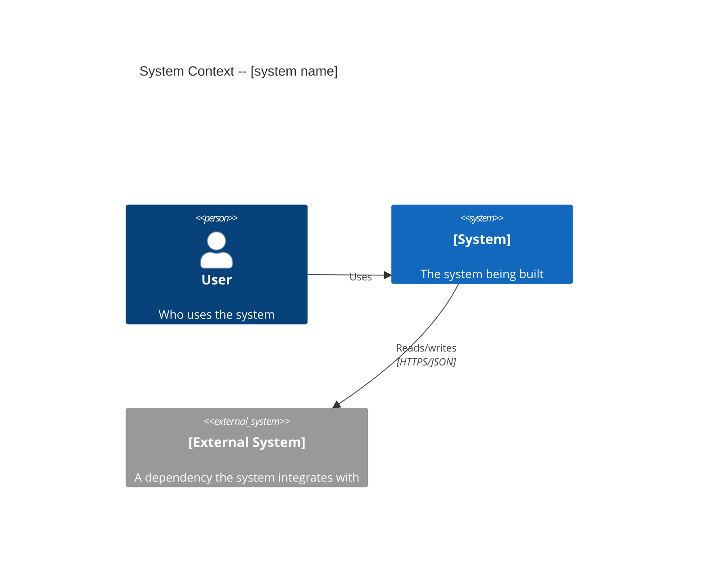
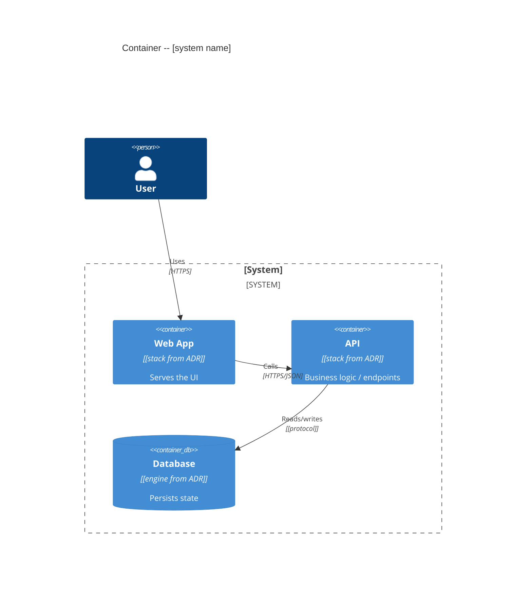

# C4 Conventions -- Mermaid, Context + Container only

The Architecture phase draws the system with the **C4 model** (Simon Brown), scoped to the top two
levels: **System Context** and **Container**. Component and Code levels are out of scope -- they
change too fast in a greenfield system to be worth locking, and the walking skeleton (Slice 4) makes
them concrete. Diagrams are written in **Mermaid `C4Context` / `C4Container`** because the repo is
markdown-native with no build system: Mermaid renders inline in GitHub/Codeberg/VS Code viewers, is
diffable, and is AI-generatable. (Structurizr DSL is richer but needs tooling the repo lacks.)

Both diagrams live in `architecture.md` as fenced ` ```mermaid ` blocks.

## Level 1 -- System Context

Who/what uses the system and what external systems it talks to. One box for the system, actors
around it, external systems at the edge. No internals.



## Level 2 -- Container

The runnable/deployable units inside the system boundary (web app, API, worker, database, queue) and
how they communicate. This is the level the ADRs constrain and the skeleton instantiates.



## `architecture.md` summary shape

```markdown
---
date: YYYY-MM-DD
phase: Architecture (A)
qraspi_project: [project-slug]
adr_dir: [target]/docs/adr/
status: complete
---

# Architecture: [system name]

## Summary
[2-3 paragraphs: the shape of the system and the decisions that define it. The only section the
Skeleton phase MUST read in full.]

## Accepted ADRs   <!-- the INDEX -- ADR bodies live in docs/adr/ -->
| ADR | Decision | Gated by |
|-----|----------|----------|
| [0001](../../../<target>/docs/adr/0001-*.md) | [title] | [fitness fn id / n/a] |

## C4 -- System Context
` ```mermaid ` ... ` ``` `

## C4 -- Container
` ```mermaid ` ... ` ``` `

## Fitness functions (spec)
[see references/fitness-spec.md -- the spec table handed off to the fitness-functions primitive]
```

## Authoring rules

- **Two levels, no more.** Context + Container. If you reach for Component, stop -- that is the
  skeleton's job.
- **Containers reflect the ADRs.** Each container's technology tag is a decision from an accepted
  ADR, not a guess. If a container's stack is undecided, it is a missing ADR, not a diagram detail.
- **Render-check.** The Mermaid must parse; a diagram that does not render is worse than prose.
